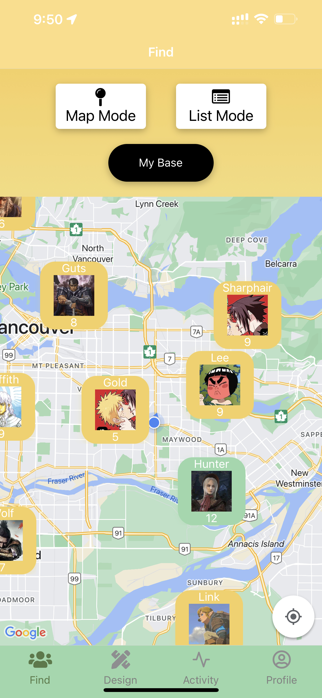
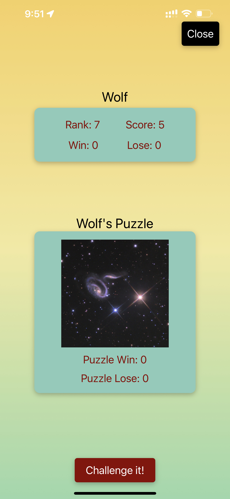
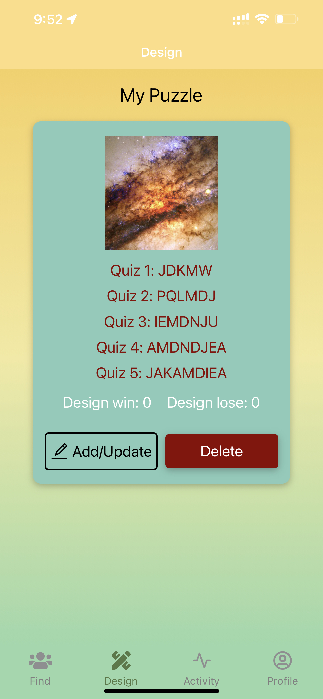

# 5520 Final project 
Group 8: Fengting Tang, Chenlei Luo

## App name  
Memory Master

## Stage
Iteration 2  

Added functionalities:
- Authentication
- Camera use
- Location use
- External API use

To be added:  
- Notification

## Contribution
Fengting Tang
Mainly responsible for functionalities and data management, including integrating firebase services, designing data model and corresponding CRUD function, and implementing functionalities of all components.

Chenlei Luo
Mainly responsible for component design and implementation, including designing the structures of all the screens and components, testing all the functionalities, and implementing the styling of all components.

## UI
1. Login Page

2. Signup Page

3. Find Page(list mode)

4. Find Page(Map mode)

5. Other player info Page(after clicking user marker)

6. Design Page

7. Activity Page

8. Profile Page

## Data model  
To be optimized...
### Collections  
1. users  
fields: id, name, avatar, email, win, lose, location  

2. puzzles  
fields: userId(id from "users" collection), coverImageUri, puzzle, win, lose  

3. activities  
fields: title, imageUri, intro, organizer(id from "users" collection), participants(list of id from "users collection")  

### Storage  
used to save users' avatars and cover images of activities  
folders: avatars, activities

## Description   
Welcome to our innovative mobile app that blends the thrill of a memory puzzle game with the social connections of a dynamic platform. Challenge yourself with mind-boggling puzzles created by fellow players or showcase your brilliance by designing tricky puzzles to stump others.  

Connect with like-minded individuals, share your achievements, and participate in on-site activities to make new friends. Our map-based interface lets you discover the clever minds in your neighborhood and compete for the title of the smartest!  

Are you up for the challenge? Join now and prove your wit! Beat the competition and earn the bragging rights you deserve!  

## Slogan  
Challenge, Connect, Conquer! Memory puzzles & social fun!  

## Target Users   
People aged over 12 who are brain training fans  

